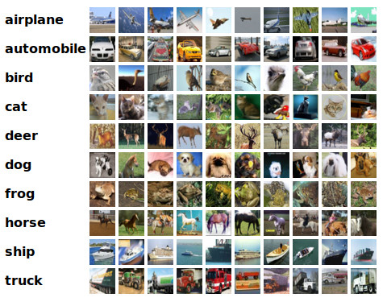

# KerasNets

In the name of God

This repository contains implementation of some deep neural networks by Keras.

## Models

### LeNet-5

LeNet-5 was one of the earliest convolutional neural networks and promoted the development of deep learning. Since 1988,
after years of research and many successful iterations, the pioneering work has been named LeNet-5.

[Read more](lenet_5)...


### AlexNet

AlexNet competed in the ImageNet Large Scale Visual Recognition Challenge on September 30, 2012. The network achieved a top-5
error of 15.3%, more than 10.8 percentage points lower than that of the runner up. The original paper's primary result
was that the depth of the model was essential for its high performance, which was computationally expensive, but made
feasible due to the utilization of graphics processing units (GPUs) during training.

[Read more](alexnet)...


## Datasets

### MNIST

The MNIST database of handwritten digits, has a training set of 60000 examples, and a test set of 10000 examples.
It is a subset of a larger set available from NIST. The digits have been size-normalized and centered in a fixed-size image.


### CIFAR-10

The CIFAR-10 dataset consists of 60000 32x32 color images in 10 classes, with 6000 images per class.
There are 50000 training images and 10000 test images.



## Pre-trained Models

You can download pre-trained models from [this page](https://github.com/amir-saniyan/KerasNets/releases/tag/pre-trained-models):

* [Download LeNet-5 Pre-trained Model](https://github.com/amir-saniyan/KerasNets/releases/download/pre-trained-models/lenet_5.zip)

## License

```
MIT License

Permission is hereby granted, free of charge, to any person obtaining a copy
of this software and associated documentation files (the "Software"), to deal
in the Software without restriction, including without limitation the rights
to use, copy, modify, merge, publish, distribute, sublicense, and/or sell
copies of the Software, and to permit persons to whom the Software is
furnished to do so, subject to the following conditions:

The above copyright notice and this permission notice shall be included in all
copies or substantial portions of the Software.

THE SOFTWARE IS PROVIDED "AS IS", WITHOUT WARRANTY OF ANY KIND, EXPRESS OR
IMPLIED, INCLUDING BUT NOT LIMITED TO THE WARRANTIES OF MERCHANTABILITY,
FITNESS FOR A PARTICULAR PURPOSE AND NONINFRINGEMENT. IN NO EVENT SHALL THE
AUTHORS OR COPYRIGHT HOLDERS BE LIABLE FOR ANY CLAIM, DAMAGES OR OTHER
LIABILITY, WHETHER IN AN ACTION OF CONTRACT, TORT OR OTHERWISE, ARISING FROM,
OUT OF OR IN CONNECTION WITH THE SOFTWARE OR THE USE OR OTHER DEALINGS IN THE
SOFTWARE.
```

## Resources

* LeNet-5: http://yann.lecun.com/exdb/publis/pdf/lecun-98.pdf
* MNIST Dataset: http://yann.lecun.com/exdb/mnist/
* CIFAR-10 Dataset: https://www.cs.toronto.edu/~kriz/cifar.html
