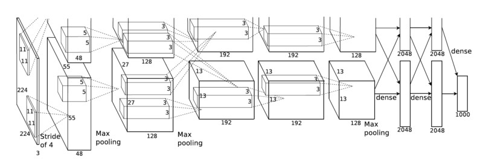

# AlexNet

[AlexNet](https://papers.nips.cc/paper/4824-imagenet-classification-with-deep-convolutional-neural-networks.pdf)
competed in the ImageNet Large Scale Visual Recognition Challenge on September 30, 2012. The network achieved a top-5
error of 15.3%, more than 10.8 percentage points lower than that of the runner up. The original paper's primary result
was that the depth of the model was essential for its high performance, which was computationally expensive, but made
feasible due to the utilization of graphics processing units (GPUs) during training.



This directory contains implementation of AlexNet (ImageNet Classification with Deep Convolutional Neural Networks) by
Keras.

**Model Summary**:

```
_________________________________________________________________
 Layer (type)                Output Shape              Param #   
=================================================================
 input_1 (InputLayer)        [(None, 227, 227, 3)]     0         
                                                                 
 conv2d (Conv2D)             (None, 55, 55, 96)        34944     
                                                                 
 batch_normalization (BatchN  (None, 55, 55, 96)       384       
 ormalization)                                                   
                                                                 
 max_pooling2d (MaxPooling2D  (None, 27, 27, 96)       0         
 )                                                               
                                                                 
 conv2d_1 (Conv2D)           (None, 27, 27, 256)       614656    
                                                                 
 batch_normalization_1 (Batc  (None, 27, 27, 256)      1024      
 hNormalization)                                                 
                                                                 
 max_pooling2d_1 (MaxPooling  (None, 13, 13, 256)      0         
 2D)                                                             
                                                                 
 conv2d_2 (Conv2D)           (None, 13, 13, 384)       885120    
                                                                 
 conv2d_3 (Conv2D)           (None, 13, 13, 384)       1327488   
                                                                 
 conv2d_4 (Conv2D)           (None, 13, 13, 256)       884992    
                                                                 
 max_pooling2d_2 (MaxPooling  (None, 6, 6, 256)        0         
 2D)                                                             
                                                                 
 flatten (Flatten)           (None, 9216)              0         
                                                                 
 dense (Dense)               (None, 4096)              37752832  
                                                                 
 dropout (Dropout)           (None, 4096)              0         
                                                                 
 dense_1 (Dense)             (None, 4096)              16781312  
                                                                 
 dropout_1 (Dropout)         (None, 4096)              0         
                                                                 
 dense_2 (Dense)             (None, 1000)              4097000   
                                                                 
=================================================================
Total params: 62,379,752
Trainable params: 62,379,048
Non-trainable params: 704
_________________________________________________________________
```

## Dataset

The network trained and tested with the [CIFAR-10](https://www.cs.toronto.edu/~kriz/cifar.html) dataset.

The CIFAR-10 dataset consists of 60000 32x32 color images in 10 classes, with 6000 images per class.
There are 50000 training images and 10000 test images.


All image resized to 80x80 for both train and test.

## Install Prerequisites

To install prerequisites run the following command:

```shell
$ sudo apt install python3 python3-wheel python3-pip python3-venv python3-dev python3-setuptools
```

## Create Virtual Environment

Create an isolated [Python virtual environment](https://docs.python.org/3/library/venv.html) using the `venv` standard
library module. This will keep dependant Python packages from interfering with other Python projects on your system.

```shell
$ python3 -m venv venv
$ source venv/bin/activate
```

Once activated, update core packaging tools (`pip`, `setuptools`, and `wheel`) to the latest versions.

```shell
(venv) $ pip install --upgrade pip setuptools wheel
```

## Install Requirements

To install requirements, run the following command:

```shell
(venv) $ pip install -r requirements.txt
````

## Training

To train the network with CIFAR-10 dataset, run the following command:

```shell
(venv) $ python ./train.py \
    --train-directory ../datasets/CIFAR-10/train \
    --batch-size 128 \
    --input-image-width 80 \
    --input-image-height 80 \
    --shuffle True \
    --seed 0 \
    --dropout-rate 0.5 \
    --learning-rate 0.01 \
    --momentum 0.9 \
    --epochs 50 \
    --validation_split 0.20 \
    --logs-path ./logs \
    --model-path ./checkpoint
```

or simply train with default values:

```shell
(venv) $ python ./train.py
```

**Train Script Usage**:

```shell
(venv) $  python ./train.py --help
usage: train.py [-h] [--train-directory TRAIN_DIRECTORY] [--batch-size BATCH_SIZE] [--input-image-width INPUT_IMAGE_WIDTH] [--input-image-height INPUT_IMAGE_HEIGHT] [--shuffle SHUFFLE] [--seed SEED]
                [--dropout-rate DROPOUT_RATE] [--learning-rate LEARNING_RATE] [--momentum MOMENTUM] [--epochs EPOCHS] [--validation_split VALIDATION_SPLIT] [--logs-path LOGS_PATH] [--model-path MODEL_PATH]

Trains the model

optional arguments:
  -h, --help            show this help message and exit
  --train-directory TRAIN_DIRECTORY
                        Directory where the train data is located
  --batch-size BATCH_SIZE
                        Size of the batches of data
  --input-image-width INPUT_IMAGE_WIDTH
                        Input image width
  --input-image-height INPUT_IMAGE_HEIGHT
                        Input image height
  --shuffle SHUFFLE     Whether to shuffle the data
  --seed SEED           Random seed for shuffling and transformations
  --dropout-rate DROPOUT_RATE
                        Fraction of the input units to drop
  --learning-rate LEARNING_RATE
                        Learning rate
  --momentum MOMENTUM   Hyper-parameter that accelerates gradient descent in the relevant direction and dampens oscillations
  --epochs EPOCHS       Number of epochs
  --validation_split VALIDATION_SPLIT
                        Fraction of the training data to be used as validation data
  --logs-path LOGS_PATH
                        Path of the directory where to save the log files to be parsed by TensorBoard
  --model-path MODEL_PATH
                        Path to save the model
```

**Visualizing Metrics**:

TensorBoard is a visualization tool provided with TensorFlow to tracking and visualizing metrics such as loss and
accuracy.

To launch TensorBoard, run the following command:

```shell
(venv) $ tensorboard --logdir ./logs
```


**Training Results**:

| Epoch | Loss   | Accuracy | Loss (Val) | Accuracy (Val) |
|-------|--------|----------|------------|----------------|
| 1     | 1.6648 | 0.3796   | 1.5405     | 0.4316         |
| 2     | 1.2359 | 0.5535   | 1.2859     | 0.5464         |
| 3     | 1.0340 | 0.6339   | 1.2448     | 0.5736         |
| ...   | ...    | ...      | ...        | ...            |
| 50    | 0.0052 | 0.9983   | 1.9202     | 0.7477         |

## Evaluating

To evaluate the network with CIFAR-10 dataset, run the following command:

```shell
(venv) $ python ./evaluate.py \
    --test-directory ../datasets/CIFAR-10/test \
    --batch-size 128 \
    --model-path ./checkpoint
```

or simply evaluate with default values:

```shell
(venv) $ python ./evaluate.py
```

**Evaluate Script Usage**:

```shell
(venv) $ python ./evaluate.py --help
usage: evaluate.py [-h] [--test-directory TEST_DIRECTORY] [--batch-size BATCH_SIZE] [--model-path MODEL_PATH]

Evaluates the model

optional arguments:
  -h, --help            show this help message and exit
  --test-directory TEST_DIRECTORY
                        Directory where the test data is located
  --batch-size BATCH_SIZE
                        Size of the batches of data
  --model-path MODEL_PATH
                        Path to load the model
```

**Evaluating Results**:

| Loss   | Accuracy |
|--------|----------|
| 0.9558 | 0.6862   |

## Prediction

To predict the network with an image, run the following command:

```shell
(venv) $ python ./predict.py \
    --image-path <image-path>
```

for example to predict this image:


run the following command:

```shell
(venv) $ python ./predict.py \
    --image-path ../datasets/CIFAR-10/test/airplane/aeroplane_s_000040.png
```

output:

```
Predicted index: 0
Predicted label (CIFAR-10): airplane
```

**Predict Script Usage**:

```shell
(venv) $ python ./predict.py --help
usage: predict.py [-h] --image-path IMAGE_PATH [--model-path MODEL_PATH]

Predicts the model

optional arguments:
  -h, --help            show this help message and exit
  --image-path IMAGE_PATH
                        Image path to predict
  --model-path MODEL_PATH
                        Path to load the model
```

## Pre-trained Model

You can download pre-trained models
from [this page](https://github.com/amir-saniyan/KerasNets/releases/tag/pre-trained-models) or
directly [download](https://github.com/amir-saniyan/KerasNets/releases/download/pre-trained-models/alexnet.zip) AlexNet
pre-trained model.

## Resources

* https://papers.nips.cc/paper/4824-imagenet-classification-with-deep-convolutional-neural-networks.pdf
* https://www.cs.toronto.edu/~kriz/cifar.html
