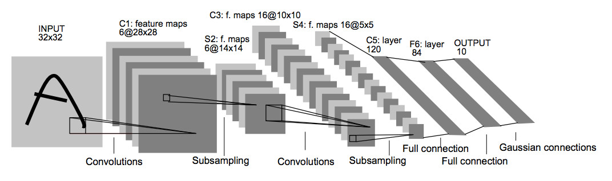
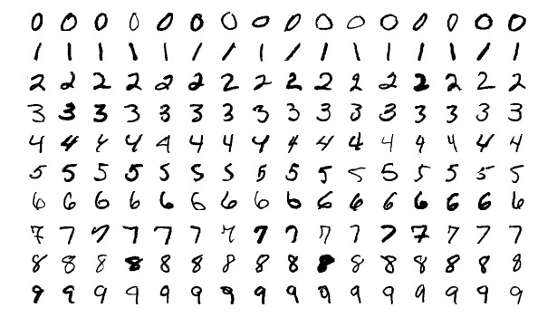
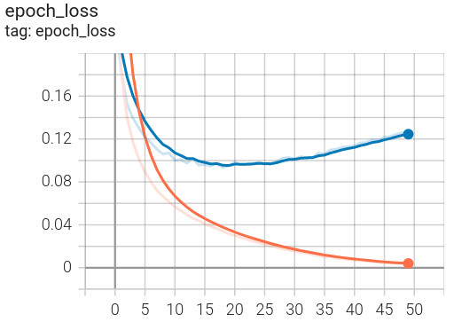

# LeNet-5

[LeNet-5](http://yann.lecun.com/exdb/publis/pdf/lecun-98.pdf) was one of the earliest convolutional neural networks and
promoted the development of deep learning. Since 1988, after years of research and many successful iterations, the
pioneering work has been named LeNet-5.



This directory contains implementation of LeNet-5 (Handwritten Character Recognition) by Keras.

**Model Summary**:

```
_________________________________________________________________
 Layer (type)                Output Shape              Param #   
=================================================================
 input_1 (InputLayer)        [(None, 32, 32, 1)]       0         
                                                                 
 conv2d (Conv2D)             (None, 28, 28, 6)         156       
                                                                 
 max_pooling2d (MaxPooling2D  (None, 14, 14, 6)        0         
 )                                                               
                                                                 
 conv2d_1 (Conv2D)           (None, 10, 10, 16)        2416      
                                                                 
 max_pooling2d_1 (MaxPooling  (None, 5, 5, 16)         0         
 2D)                                                             
                                                                 
 flatten (Flatten)           (None, 400)               0         
                                                                 
 dense (Dense)               (None, 120)               48120     
                                                                 
 dense_1 (Dense)             (None, 84)                10164     
                                                                 
 dense_2 (Dense)             (None, 10)                850       
                                                                 
=================================================================
Total params: 61,706
Trainable params: 61,706
Non-trainable params: 0
_________________________________________________________________
```

## Dataset

The network trained and tested with the [MNIST](http://yann.lecun.com/exdb/mnist/) dataset.

The MNIST database of handwritten digits, available from [this page](http://yann.lecun.com/exdb/mnist/), has a training
set of 60,000 examples, and a test set of 10,000 examples. It is a subset of a larger set available from NIST. The
digits have been size-normalized and centered in a fixed-size image.



## Install Prerequisites

To install prerequisites run the following command:

```shell
$ sudo apt install python3 python3-wheel python3-pip python3-venv python3-dev python3-setuptools
```

## Create Virtual Environment

Create an isolated [Python virtual environment](https://docs.python.org/3/library/venv.html) using the `venv` standard
library module. This will keep dependant Python packages from interfering with other Python projects on your system.

```shell
$ python3 -m venv venv
$ source venv/bin/activate
```

Once activated, update core packaging tools (`pip`, `setuptools`, and `wheel`) to the latest versions.

```shell
(venv) $ pip install --upgrade pip setuptools wheel
```

## Install Requirements

To install requirements, run the following command:

```shell
(venv) $ pip install -r requirements.txt
````

## Training

To train the network with MNIST dataset, run the following command:

```shell
(venv) $ python ./train.py \
    --train-directory ../datasets/MNIST/train \
    --batch-size 32 \
    --input-image-width 28 \
    --input-image-height 28 \
    --shuffle True \
    --seed 0 \
    --learning-rate 0.001 \
    --epochs 50 \
    --validation_split 0.20 \
    --logs-path ./logs \
    --model-path ./checkpoint
```

or simply train with default values:

```shell
(venv) $ python ./train.py
```

**Train Script Usage**:

```shell
(venv) $ python ./train.py --help

usage: train.py [-h] [--train-directory TRAIN_DIRECTORY] [--batch-size BATCH_SIZE] [--input-image-width INPUT_IMAGE_WIDTH] [--input-image-height INPUT_IMAGE_HEIGHT] [--shuffle SHUFFLE] [--seed SEED]
                [--learning-rate LEARNING_RATE] [--epochs EPOCHS] [--validation_split VALIDATION_SPLIT] [--logs-path LOGS_PATH] [--model-path MODEL_PATH]

Trains the model

optional arguments:
  -h, --help            show this help message and exit
  --train-directory TRAIN_DIRECTORY
                        Directory where the train data is located
  --batch-size BATCH_SIZE
                        Size of the batches of data
  --input-image-width INPUT_IMAGE_WIDTH
                        Input image width
  --input-image-height INPUT_IMAGE_HEIGHT
                        Input image height
  --shuffle SHUFFLE     Whether to shuffle the data
  --seed SEED           Random seed for shuffling and transformations
  --learning-rate LEARNING_RATE
                        Learning rate
  --epochs EPOCHS       Number of epochs
  --validation_split VALIDATION_SPLIT
                        Fraction of the training data to be used as validation data
  --logs-path LOGS_PATH
                        Path of the directory where to save the log files to be parsed by TensorBoard
  --model-path MODEL_PATH
                        Path to save the model
```

**Visualizing Metrics**:

TensorBoard is a visualization tool provided with TensorFlow to tracking and visualizing metrics such as loss and
accuracy.

To launch TensorBoard, run the following command:

```shell
(venv) $ tensorboard --logdir ./logs
```




**Training Results**:

| Epoch | Loss   | Accuracy | Loss (Val) | Accuracy (Val) |
|-------|--------|----------|------------|----------------|
| 1     | 0.5758 | 0.8520   | 0.2376     | 0.9296         |
| 2     | 0.1847 | 0.9436   | 0.1847     | 0.9473         |
| 3     | 0.1403 | 0.9556   | 0.1526     | 0.9573         |
| ...   | ...    | ...      | ...        | ...            |
| 50    | 0.0035 | 0.9997   | 0.1259     | 0.9788         |

## Evaluating

To evaluate the network with MNIST dataset, run the following command:

```shell
(venv) $ python ./evaluate.py \
    --test-directory ../datasets/MNIST/test \
    --batch-size 32 \
    --model-path ./checkpoint
```

or simply evaluate with default values:

```shell
(venv) $ python ./evaluate.py
```

**Evaluate Script Usage**:

```shell
(venv) $ python ./evaluate.py --help

usage: evaluate.py [-h] [--test-directory TEST_DIRECTORY] [--batch-size BATCH_SIZE] [--model-path MODEL_PATH]

Evaluates the model

optional arguments:
  -h, --help            show this help message and exit
  --test-directory TEST_DIRECTORY
                        Directory where the test data is located
  --batch-size BATCH_SIZE
                        Size of the batches of data
  --model-path MODEL_PATH
                        Path to load the model
```

**Evaluating Results**:

| Loss   | Accuracy |
|--------|----------|
| 0.0841 | 0.9748   |

## Prediction

To predict the network with an image, run the following command:

```shell
(venv) $ python ./predict.py \
    --image-path <image-path>
```

for example to predict this image:


run the following command:

```shell
(venv) $ python ./predict.py \
    --image-path ../datasets/MNIST/test/0/3.png
```

output:

```
Predicted index: 0
Predicted label (MNIST): 0
```

**Predict Script Usage**:

```shell
(venv) $ python ./predict.py --help

usage: predict.py [-h] --image-path IMAGE_PATH [--model-path MODEL_PATH]

Predicts the model

optional arguments:
  -h, --help            show this help message and exit
  --image-path IMAGE_PATH
                        Image path to predict
  --model-path MODEL_PATH
                        Path to load the model

```

## Pre-trained Model

You can download pre-trained models
from [this page](https://github.com/amir-saniyan/KerasNets/releases/tag/pre-trained-models) or
directly [download](https://github.com/amir-saniyan/KerasNets/releases/download/pre-trained-models/lenet_5.zip) LeNet-5
pre-trained model.

## Resources

* http://yann.lecun.com/exdb/lenet/
* http://yann.lecun.com/exdb/publis/pdf/lecun-98.pdf
* http://yann.lecun.com/exdb/mnist/
