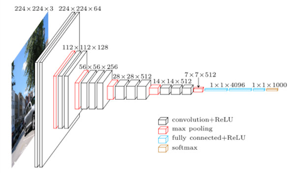
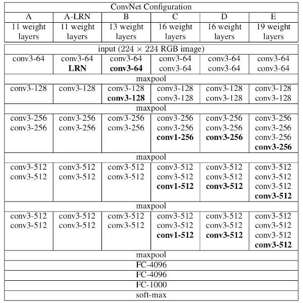
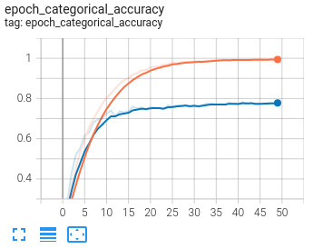
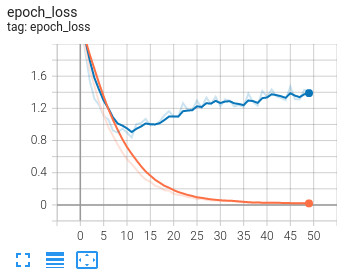

# VGG

[VGG](https://arxiv.org/abs/1409.1556v6) is a classical convolutional neural network architecture. It was based on an
analysis of how to increase the depth of such networks. The network utilises small 3 x 3 filters. Otherwise, the network
is characterized by its simplicity: the only other components being pooling layers and a fully connected layer.



**VGG Configurations**:

The depth of the configurations increases from the left (A) to the right (E), as more layers are added (the added layers
are shown in bold). The convolutional layer parameters are denoted as "conv&lt;receptive field size&gt;-&lt;number of
channels&gt;". The ReLU activation function is not shown for brevity.



This directory contains implementation of VGG (Very Deep Convolutional Networks for Large-Scale Image Recognition) by
Keras.

**Model Summary (VGG11)**:

```
 Layer (type)                Output Shape              Param #   
=================================================================
 input_1 (InputLayer)        [(None, 224, 224, 3)]     0         
                                                                 
 conv2d (Conv2D)             (None, 224, 224, 64)      1792      
                                                                 
 max_pooling2d (MaxPooling2D  (None, 112, 112, 64)     0         
 )                                                               
                                                                 
 conv2d_1 (Conv2D)           (None, 112, 112, 128)     73856     
                                                                 
 max_pooling2d_1 (MaxPooling  (None, 56, 56, 128)      0         
 2D)                                                             
                                                                 
 conv2d_2 (Conv2D)           (None, 56, 56, 256)       295168    
                                                                 
 conv2d_3 (Conv2D)           (None, 56, 56, 256)       590080    
                                                                 
 max_pooling2d_2 (MaxPooling  (None, 28, 28, 256)      0         
 2D)                                                             
                                                                 
 conv2d_4 (Conv2D)           (None, 28, 28, 512)       1180160   
                                                                 
 conv2d_5 (Conv2D)           (None, 28, 28, 512)       2359808   
                                                                 
 max_pooling2d_3 (MaxPooling  (None, 14, 14, 512)      0         
 2D)                                                             
                                                                 
 conv2d_6 (Conv2D)           (None, 14, 14, 512)       2359808   
                                                                 
 conv2d_7 (Conv2D)           (None, 14, 14, 512)       2359808   
                                                                 
 max_pooling2d_4 (MaxPooling  (None, 7, 7, 512)        0         
 2D)                                                             
                                                                 
 flatten (Flatten)           (None, 25088)             0         
                                                                 
 dense (Dense)               (None, 4096)              102764544 
                                                                 
 dropout (Dropout)           (None, 4096)              0         
                                                                 
 dense_1 (Dense)             (None, 4096)              16781312  
                                                                 
 dropout_1 (Dropout)         (None, 4096)              0         
                                                                 
 dense_2 (Dense)             (None, 1000)              4097000   
                                                                 
=================================================================
Total params: 132,863,336
Trainable params: 132,863,336
Non-trainable params: 0
_________________________________________________________________
```

**Model Summary (VGG13)**:

```
_________________________________________________________________
 Layer (type)                Output Shape              Param #   
=================================================================
 input_1 (InputLayer)        [(None, 224, 224, 3)]     0         
                                                                 
 conv2d (Conv2D)             (None, 224, 224, 64)      1792      
                                                                 
 conv2d_1 (Conv2D)           (None, 224, 224, 64)      36928     
                                                                 
 max_pooling2d (MaxPooling2D  (None, 112, 112, 64)     0         
 )                                                               
                                                                 
 conv2d_2 (Conv2D)           (None, 112, 112, 128)     73856     
                                                                 
 conv2d_3 (Conv2D)           (None, 112, 112, 128)     147584    
                                                                 
 max_pooling2d_1 (MaxPooling  (None, 56, 56, 128)      0         
 2D)                                                             
                                                                 
 conv2d_4 (Conv2D)           (None, 56, 56, 256)       295168    
                                                                 
 conv2d_5 (Conv2D)           (None, 56, 56, 256)       590080    
                                                                 
 max_pooling2d_2 (MaxPooling  (None, 28, 28, 256)      0         
 2D)                                                             
                                                                 
 conv2d_6 (Conv2D)           (None, 28, 28, 512)       1180160   
                                                                 
 conv2d_7 (Conv2D)           (None, 28, 28, 512)       2359808   
                                                                 
 max_pooling2d_3 (MaxPooling  (None, 14, 14, 512)      0         
 2D)                                                             
                                                                 
 conv2d_8 (Conv2D)           (None, 14, 14, 512)       2359808   
                                                                 
 conv2d_9 (Conv2D)           (None, 14, 14, 512)       2359808   
                                                                 
 max_pooling2d_4 (MaxPooling  (None, 7, 7, 512)        0         
 2D)                                                             
                                                                 
 flatten (Flatten)           (None, 25088)             0         
                                                                 
 dense (Dense)               (None, 4096)              102764544 
                                                                 
 dropout (Dropout)           (None, 4096)              0         
                                                                 
 dense_1 (Dense)             (None, 4096)              16781312  
                                                                 
 dropout_1 (Dropout)         (None, 4096)              0         
                                                                 
 dense_2 (Dense)             (None, 1000)              4097000   
                                                                 
=================================================================
Total params: 133,047,848
Trainable params: 133,047,848
Non-trainable params: 0
_________________________________________________________________
```

**Model Summary (VGG16)**:

```
_________________________________________________________________
 Layer (type)                Output Shape              Param #   
=================================================================
 input_1 (InputLayer)        [(None, 224, 224, 3)]     0         
                                                                 
 conv2d (Conv2D)             (None, 224, 224, 64)      1792      
                                                                 
 conv2d_1 (Conv2D)           (None, 224, 224, 64)      36928     
                                                                 
 max_pooling2d (MaxPooling2D  (None, 112, 112, 64)     0         
 )                                                               
                                                                 
 conv2d_2 (Conv2D)           (None, 112, 112, 128)     73856     
                                                                 
 conv2d_3 (Conv2D)           (None, 112, 112, 128)     147584    
                                                                 
 max_pooling2d_1 (MaxPooling  (None, 56, 56, 128)      0         
 2D)                                                             
                                                                 
 conv2d_4 (Conv2D)           (None, 56, 56, 256)       295168    
                                                                 
 conv2d_5 (Conv2D)           (None, 56, 56, 256)       590080    
                                                                 
 conv2d_6 (Conv2D)           (None, 56, 56, 256)       590080    
                                                                 
 max_pooling2d_2 (MaxPooling  (None, 28, 28, 256)      0         
 2D)                                                             
                                                                 
 conv2d_7 (Conv2D)           (None, 28, 28, 512)       1180160   
                                                                 
 conv2d_8 (Conv2D)           (None, 28, 28, 512)       2359808   
                                                                 
 conv2d_9 (Conv2D)           (None, 28, 28, 512)       2359808   
                                                                 
 max_pooling2d_3 (MaxPooling  (None, 14, 14, 512)      0         
 2D)                                                             
                                                                 
 conv2d_10 (Conv2D)          (None, 14, 14, 512)       2359808   
                                                                 
 conv2d_11 (Conv2D)          (None, 14, 14, 512)       2359808   
                                                                 
 conv2d_12 (Conv2D)          (None, 14, 14, 512)       2359808   
                                                                 
 max_pooling2d_4 (MaxPooling  (None, 7, 7, 512)        0         
 2D)                                                             
                                                                 
 flatten (Flatten)           (None, 25088)             0         
                                                                 
 dense (Dense)               (None, 4096)              102764544 
                                                                 
 dropout (Dropout)           (None, 4096)              0         
                                                                 
 dense_1 (Dense)             (None, 4096)              16781312  
                                                                 
 dropout_1 (Dropout)         (None, 4096)              0         
                                                                 
 dense_2 (Dense)             (None, 1000)              4097000   
                                                                 
=================================================================
Total params: 138,357,544
Trainable params: 138,357,544
Non-trainable params: 0
_________________________________________________________________
```

**Model Summary (VGG19)**:

```
_________________________________________________________________
 Layer (type)                Output Shape              Param #   
=================================================================
 input_1 (InputLayer)        [(None, 224, 224, 3)]     0         
                                                                 
 conv2d (Conv2D)             (None, 224, 224, 64)      1792      
                                                                 
 conv2d_1 (Conv2D)           (None, 224, 224, 64)      36928     
                                                                 
 max_pooling2d (MaxPooling2D  (None, 112, 112, 64)     0         
 )                                                               
                                                                 
 conv2d_2 (Conv2D)           (None, 112, 112, 128)     73856     
                                                                 
 conv2d_3 (Conv2D)           (None, 112, 112, 128)     147584    
                                                                 
 max_pooling2d_1 (MaxPooling  (None, 56, 56, 128)      0         
 2D)                                                             
                                                                 
 conv2d_4 (Conv2D)           (None, 56, 56, 256)       295168    
                                                                 
 conv2d_5 (Conv2D)           (None, 56, 56, 256)       590080    
                                                                 
 conv2d_6 (Conv2D)           (None, 56, 56, 256)       590080    
                                                                 
 conv2d_7 (Conv2D)           (None, 56, 56, 256)       590080    
                                                                 
 max_pooling2d_2 (MaxPooling  (None, 28, 28, 256)      0         
 2D)                                                             
                                                                 
 conv2d_8 (Conv2D)           (None, 28, 28, 512)       1180160   
                                                                 
 conv2d_9 (Conv2D)           (None, 28, 28, 512)       2359808   
                                                                 
 conv2d_10 (Conv2D)          (None, 28, 28, 512)       2359808   
                                                                 
 conv2d_11 (Conv2D)          (None, 28, 28, 512)       2359808   
                                                                 
 max_pooling2d_3 (MaxPooling  (None, 14, 14, 512)      0         
 2D)                                                             
                                                                 
 conv2d_12 (Conv2D)          (None, 14, 14, 512)       2359808   
                                                                 
 conv2d_13 (Conv2D)          (None, 14, 14, 512)       2359808   
                                                                 
 conv2d_14 (Conv2D)          (None, 14, 14, 512)       2359808   
                                                                 
 conv2d_15 (Conv2D)          (None, 14, 14, 512)       2359808   
                                                                 
 max_pooling2d_4 (MaxPooling  (None, 7, 7, 512)        0         
 2D)                                                             
                                                                 
 flatten (Flatten)           (None, 25088)             0         
                                                                 
 dense (Dense)               (None, 4096)              102764544 
                                                                 
 dropout (Dropout)           (None, 4096)              0         
                                                                 
 dense_1 (Dense)             (None, 4096)              16781312  
                                                                 
 dropout_1 (Dropout)         (None, 4096)              0         
                                                                 
 dense_2 (Dense)             (None, 1000)              4097000   
                                                                 
=================================================================
Total params: 143,667,240
Trainable params: 143,667,240
Non-trainable params: 0
_________________________________________________________________
```

## Dataset

The network trained and tested with the [CIFAR-10](https://www.cs.toronto.edu/~kriz/cifar.html) dataset.

The CIFAR-10 dataset consists of 60000 32x32 color images in 10 classes, with 6000 images per class. There are 50000
training images and 10000 test images.


## Install Prerequisites

To install prerequisites run the following command:

```shell
$ sudo apt install python3 python3-wheel python3-pip python3-venv python3-dev python3-setuptools
```

## Create Virtual Environment

Create an isolated [Python virtual environment](https://docs.python.org/3/library/venv.html) using the `venv` standard
library module. This will keep dependant Python packages from interfering with other Python projects on your system.

```shell
$ python3 -m venv venv
$ source venv/bin/activate
```

Once activated, update core packaging tools (`pip`, `setuptools`, and `wheel`) to the latest versions.

```shell
(venv) $ pip install --upgrade pip setuptools wheel
```

## Install Requirements

To install requirements, run the following command:

```shell
(venv) $ pip install -r requirements.txt
````

## Training

To train the network with CIFAR-10 dataset, run the following command:

```shell
(venv) $ python ./train.py \
    --configuration vgg19 \
    --train-directory ../datasets/CIFAR-10/train \
    --batch-size 256 \
    --input-image-width 32 \
    --input-image-height 32 \
    --shuffle True \
    --seed 0 \
    --dropout-rate 0.5 \
    --learning-rate 0.01 \
    --momentum 0.9 \
    --epochs 50 \
    --validation_split 0.20 \
    --logs-path ./logs \
    --model-path ./checkpoint
```

or simply train with default values:

```shell
(venv) $ python ./train.py
```

**Train Script Usage**:

```shell
(venv) $ python ./train.py --help
usage: train.py [-h] [--configuration CONFIGURATION] [--train-directory TRAIN_DIRECTORY] [--batch-size BATCH_SIZE] [--input-image-width INPUT_IMAGE_WIDTH] [--input-image-height INPUT_IMAGE_HEIGHT] [--shuffle SHUFFLE]
                [--seed SEED] [--dropout-rate DROPOUT_RATE] [--learning-rate LEARNING_RATE] [--momentum MOMENTUM] [--epochs EPOCHS] [--validation_split VALIDATION_SPLIT] [--logs-path LOGS_PATH] [--model-path MODEL_PATH]

Trains the model

optional arguments:
  -h, --help            show this help message and exit
  --configuration CONFIGURATION
                        Model configuration, one of: vgg11, vgg13, vgg16, vgg19
  --train-directory TRAIN_DIRECTORY
                        Directory where the train data is located
  --batch-size BATCH_SIZE
                        Size of the batches of data
  --input-image-width INPUT_IMAGE_WIDTH
                        Input image width
  --input-image-height INPUT_IMAGE_HEIGHT
                        Input image height
  --shuffle SHUFFLE     Whether to shuffle the data
  --seed SEED           Random seed for shuffling and transformations
  --dropout-rate DROPOUT_RATE
                        Fraction of the input units to drop
  --learning-rate LEARNING_RATE
                        Learning rate
  --momentum MOMENTUM   Hyper-parameter that accelerates gradient descent in the relevant direction and dampens oscillations
  --epochs EPOCHS       Number of epochs
  --validation_split VALIDATION_SPLIT
                        Fraction of the training data to be used as validation data
  --logs-path LOGS_PATH
                        Path of the directory where to save the log files to be parsed by TensorBoard
  --model-path MODEL_PATH
                        Path to save the model
```

**Visualizing Metrics**:

TensorBoard is a visualization tool provided with TensorFlow to tracking and visualizing metrics such as loss and
accuracy.

To launch TensorBoard, run the following command:

```shell
(venv) $ tensorboard --logdir ./logs
```





**Training Results**:

| Epoch | Loss   | Accuracy | Loss (Val) | Accuracy (Val) |
|-------|--------|----------|------------|----------------|
| 1     | 2.2411 | 0.1463   | 2.2871     | 0.1964         |
| 2     | 1.9682 | 0.2670   | 1.9287     | 0.2781         |
| 3     | 1.6822 | 0.3658   | 1.5490     | 0.4286         |
| ...   | ...    | ...      | ...        | ...            |
| 50    | 0.0165 | 0.9949   | 1.4107     | 0.7807         |

## Evaluating

To evaluate the network with CIFAR-10 dataset, run the following command:

```shell
(venv) $ python ./evaluate.py \
    --test-directory ../datasets/CIFAR-10/test \
    --batch-size 256 \
    --model-path ./checkpoint
```

or simply evaluate with default values:

```shell
(venv) $ python ./evaluate.py
```

**Evaluate Script Usage**:

```shell
(venv) $ python ./evaluate.py --help
usage: evaluate.py [-h] [--test-directory TEST_DIRECTORY] [--batch-size BATCH_SIZE] [--model-path MODEL_PATH]

Evaluates the model

optional arguments:
  -h, --help            show this help message and exit
  --test-directory TEST_DIRECTORY
                        Directory where the test data is located
  --batch-size BATCH_SIZE
                        Size of the batches of data
  --model-path MODEL_PATH
                        Path to load the model
```

**Evaluating Results**:

| Loss   | Accuracy |
|--------|----------|
| 0.8931 | 0.7247   |

## Prediction

To predict the network with an image, run the following command:

```shell
(venv) $ python ./predict.py \
    --image-path <image-path>
```

for example to predict this image:


run the following command:

```shell
(venv) $ python ./predict.py \
    --image-path ../datasets/CIFAR-10/test/airplane/aeroplane_s_000040.png
```

output:

```
Predicted index: 0
Predicted label (CIFAR-10): airplane
```

**Predict Script Usage**:

```shell
(venv) $ python ./predict.py --help
usage: predict.py [-h] --image-path IMAGE_PATH [--model-path MODEL_PATH]

Predicts the model

optional arguments:
  -h, --help            show this help message and exit
  --image-path IMAGE_PATH
                        Image path to predict
  --model-path MODEL_PATH
                        Path to load the model
```

## Pre-trained Model

You can download pre-trained models
from [this page](https://github.com/amir-saniyan/KerasNets/releases/tag/pre-trained-models) or
directly [download](https://github.com/amir-saniyan/KerasNets/releases/download/pre-trained-models/vgg.zip) VGG
pre-trained model.

## Resources

* https://arxiv.org/abs/1409.1556v6
* https://www.cs.toronto.edu/~kriz/cifar.html
